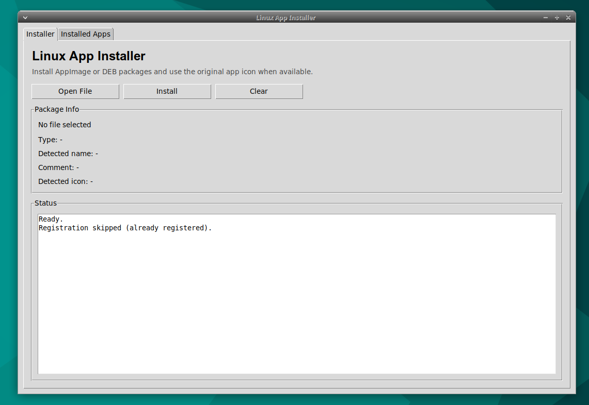
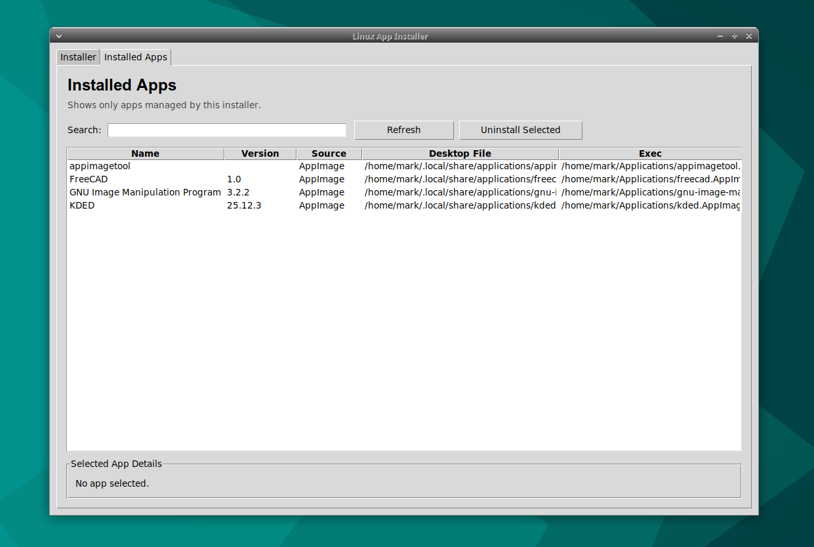

# Linux App Installer

A simple desktop application to install, manage, and launch **AppImage** and **DEB** packages on Linux.

Built with Python (Tkinter), this tool provides a clean interface for handling portable Linux applications without using the terminal.

---

## ✨ Features

* 📦 Install **AppImage** and **DEB** packages
* 🔍 Auto-detect file type and metadata
* 🖼 Extract and use **original app icons**
* 🧠 Fallback icon system (uses installer icon if missing)
* 🔁 Detect existing apps and:

  * Reinstall same version
  * Upgrade or replace different versions
* 🧾 Manage installed apps (list + uninstall)
* 🔗 Register as default opener for:

  * `.AppImage`
  * `.deb`
* ⚙️ Works fully offline
* 💻 Built with native Linux tools (`xdg-mime`, `desktop entries`)

---

## 📸 Screenshot

> 
> 

---

## 🚀 Installation

### Option 1: Run from source

```bash
git clone https://github.com/rmsbal/linux_app_installer.git
cd linux_app_installer
python3 app.py
```

---

### Option 2: AppImage (Recommended)

1. Download the latest `.AppImage` from Releases
2. Make it executable:

```bash
chmod +x Linux_App_Installer-x86_64.AppImage
```

3. Run:

```bash
./Linux_App_Installer-x86_64.AppImage
```

---

## 🧠 How It Works

The app installs programs in user space:

* `~/Applications`
* `~/.local/share/applications`
* `~/.local/share/icons`

It creates proper `.desktop` entries so installed apps appear in your system menu.

---

## ⚠️ Notes

* No root access required
* Uses system tools like:

  * `xdg-mime`
  * `update-desktop-database`
* DEB installation depends on your system environment

---

## 🛠 Requirements

* Python 3.8+
* Tkinter
* Linux (Xubuntu, Ubuntu, etc.)

---

## 📦 Build

### AppImage

```bash
./build_appimage.sh
```
---

## 🤝 Contributing

Contributions are welcome!

* Fork the repository
* Create a feature branch
* Submit a pull request

---

## 📄 License

This project is licensed under the MIT License.

---

## 👨‍💻 Author

RMSBAL - Rey Mark Balaod |
Forester • Developer • GIS Analyst

---

## ⭐ Support

If you find this useful, give it a ⭐ on GitHub!
